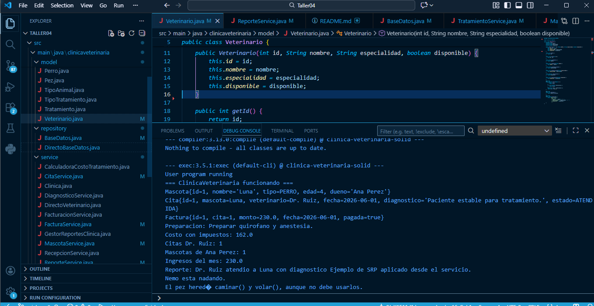

# ClinicaVeterinaria

Proyecto Java Maven para practicar refactoring con principios SOLID en un taller colaborativo.

El sistema funciona desde el inicio, pero contiene violaciones intencionales de SRP, OCP, LSP, ISP y DIP. La idea es que cada integrante refactorice una zona del código sin romper la ejecución.

## Setup en 5 minutos


Compilar con Maven. Salida esperada:

```text
=== ClinicaVeterinaria funcionando ===
```

## Estructura del proyecto

```text
src/main/java/clinicaveterinaria/
├── Main.java
├── interfaces/
│   ├── IAnimal.java
│   ├── IBaseDatos.java
│   ├── IServicioClinica.java
│   ├── ITratamiento.java
│   └── IVeterinarioService.java
├── model/
│   ├── Mascota.java
│   ├── Veterinario.java
│   ├── Cita.java
│   ├── Tratamiento.java
│   ├── Factura.java
│   └── clases auxiliares para animales y enums
├── repository/
│   ├── BaseDatos.java
│   └── DirectoBaseDatos.java
└── service/
    ├── ReservaService.java
    ├── DiagnosticoService.java
    ├── FacturacionService.java
    ├── ReporteService.java
    └── servicios CRUD y clases con violaciones intencionales
```

## Trabajo del taller

- Integrante 1: refactorizar SRP.
- Integrante 2: refactorizar OCP.
- Integrante 3: refactorizar LSP.
- Integrante 4: refactorizar ISP y DIP.

Lee `guia.md` para instrucciones, checklists y preguntas de discusión.


## Integrante #1
### ¿Que se realizó?
Se tenía identificado que la clase `Veterinario` mezclaba datos de la misma con comportamientos del negocio, exclusivamente en los métodos: `reservarCita()`, `diagnosticar()`, `generarFactura()`, `crearReporte()`. Cada uno de los métodos realizaban acciones que no tenían que ver con la clase, por lo que la misma tenía mas de una responsabilidad, incumpliendo el primer principio SOLID (SRP).

Una vez identificado, se realizaron los cambios en los mismos, eliminando los métodos mencionando previamente y colocándolos en otras clases:
- Un método elimineado es `reservarCita()` desde Veterinario, pero este ha sido movido a `ReservaService`, haciendo que las citas sean reservadas llamando directamente a la clase, haciendo que el código sea mas fácil de mantener y totalmente legible.
- La lógica de diagnóstico `diagnosticar()` fue movido a `DiagnosticoService`, haciendo que se llame directamente a la clase al realizar un diagnóstico a la mascota.
- Se movió la lógica `generarFactura()` hacia el servicio `FacturacionService`, para que toda factura llame directamente a la clase y se entregue el veterinario, diagnóstico, etc.
- Por último, se movió la lógica `crearReporte()`, la cual crea reportes de todos los diagnósticos realizados, a la clase `ReporteService`

Los cambios que se realizaron se hizo de manera exclusiva para complir con el principio de responsabilidad (SRP), al nada mas tener atributos y estado en la clase `Veterinario`, mientras que los servicios que se encontraban previamnete fueron movidos para que se gestionen aparte.

### Preguntas a responder 
1. **¿Cuántas razones para cambiar tenía `Veterinario` antes del refactoring?**
Existía un mínimo de 4 razones de cambo, las cuales eran los datos del veterinario, la reserva de citas el diagnóstico y la facturación con el reporte, ya que muchas de estas tareas las realizaba la clase Veterinario, lo que hacía una violación al principio SRP.

2. **¿Qué ganamos al separar modelo y servicios?**
Se gana un mejor acoplamiento, teniendo mas claridad en las responsabilidad que tiene cada clase, además que el proyecto puede ser mantenible y cuenta con una facilidad para probar las partes por separado.

3. **¿Qué clase debería cambiar si mañana cambia el formato del reporte?**
ReportService, debido a que el formato del reporte es responsabilidad única de esa clase, mas no de la anterior que era Veterinario.

### Validaciones
| Criterio | Sí/No |
| --- | --- |
| El proyecto compila | Si |
| `Veterinario` ya no reserva, diagnostica, factura ni reporta | Si |
| La funcionalidad del `Main` se mantiene | Si |
| Los nombres de servicios son claros | Si |

